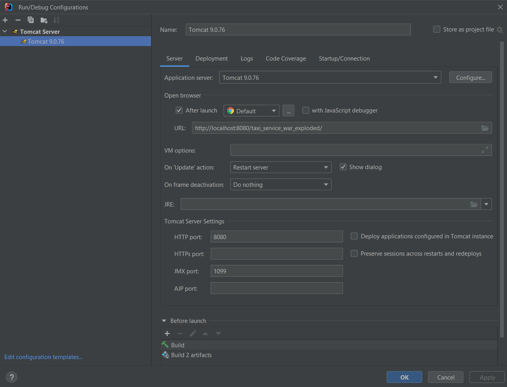
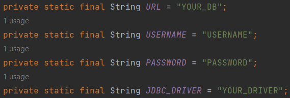

# 🚕Taxi-Service🚕
##  📌 Project description 
This project demonstrates my practical expertise 
in various technologies, including Java, 
object-oriented programming (OOP), SOLID principles,
JDBC (Java Database Connectivity), Java Web development,
JSP (JavaServer Pages), JSTL (JavaServer Pages Standard Tag Library),
and incorporates SQL for establishing relationships within the database.
 
## 📌 Features
👉register as a driver;\
👉login as driver;\
👉create/update/delete a driver;\
👉display all drivers\
👉create/update/delete a car;\
👉display all cars;\
👉create/update/delete a manufacturer;\
👉display all manufacturers;\
👉add a driver to a car;\
👉display all cars for current login driver;

## 📌 Project Architecture

The project is structured using a multi-level architecture, which includes the following components:

#### 👉DAO (Data Access Object)
The DAO layer serves as the interface for communicating with the database. It encapsulates 
the operations related to data access and manipulation.

#### 👉Service
The Service layer acts as an intermediary between the DAO layer and the user interface.
It is responsible for executing queries to the database and implementing the business logic of the application.

#### 👉Controller
The Controller layer focuses on the presentation of the user
interface and handling user interactions. It receives requests from the user interface
and communicates with the Service layer to retrieve or update data.

By employing this multi-level architecture, the project ensures a clear separation of
concerns and promotes code organization and maintainability.

## Technologies 🚀

- **Java 11**
- **JDBC**
- **JSP**
- **JSTL 1.2**
- **Maven 3.1.1**
- **MySQL 8.0.22**
- **Servlet API 4.0.1**
- **Tomcat 9.0.50**

### Installation 🛠️

Follow these steps to set up and run the project:

1. 🍴 Fork this project to your repository.
2. 🔽 Clone the project using the HTTPS or SSH URL:
   git clone <clone-url>
3. 📦 Install **MySQL**.
4. 🌐 Install **Apache Tomcat** (version 9.0.50).
5. ⚙️ Add a new Tomcat local server configuration to your project.
In the "Application server" field, specify the path to your Tomcat installation:

6. ✍️ Open the `ConnectionUtil.java`  in the `util` package and configure your properties:

7. 🗃️ Run the SQL script located at `resources/init_db.sql` to create the necessary schema and tables for the project.
8. ▶️ Run the project.

